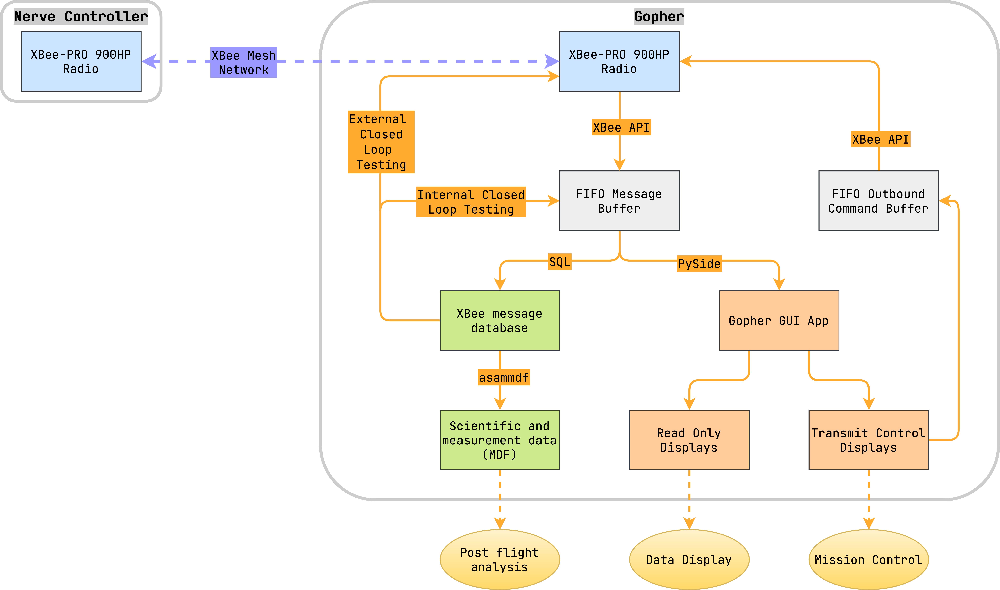
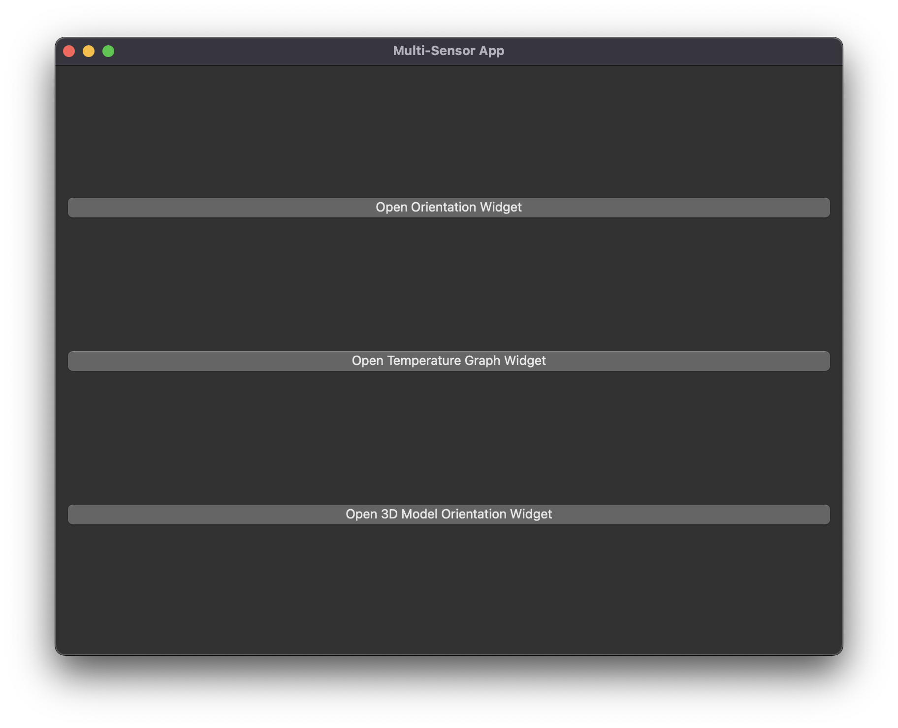
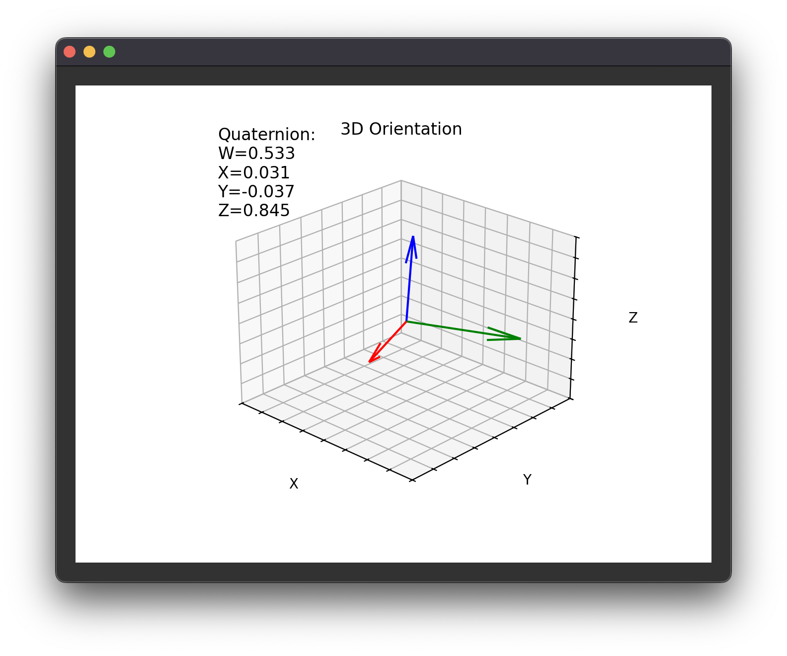

# gopher

Ground station for Nerve controller system.

---

  
Table of Contents

<!-- TOC -->
- [gopher](#gopher)
  - [1 Overview](#1-overview)
  - [2 Development](#2-development)
  - [3 Release Notes](#3-release-notes)
    - [3.1 v0.1.0-alpha](#31-v010-alpha)
<!-- TOC -->

---

## 1 Overview

> Drawio file here: [gopher.drawio](docs/gopher.drawio)

|                          Main Screen                          |                            Quaternion Display                             |                               Quaternion Model Display                                |
|:-------------------------------------------------------------:|:-------------------------------------------------------------------------:|:-------------------------------------------------------------------------------------:|
|  |  |  |

- Pictures and GIF animation show v0.1.0-alpha concept prototype with
  [nerve_ada_board](https://github.com/danielljeon/nerve_ada_board).

---

## 2 Development

Developed using [PlatformIO](https://platformio.org/).

---

## 3 Release Notes

### 3.1 v0.1.0-alpha

Pre-release concept prototype.

- **Python desktop application** (exe package-able).
- SQLite XBee message database logging.
- Live telemetry display.
    - Quaternion 3 vector display.
    - Quaternion 3D model display.
    - 2 axis graph display (temperature demo).
