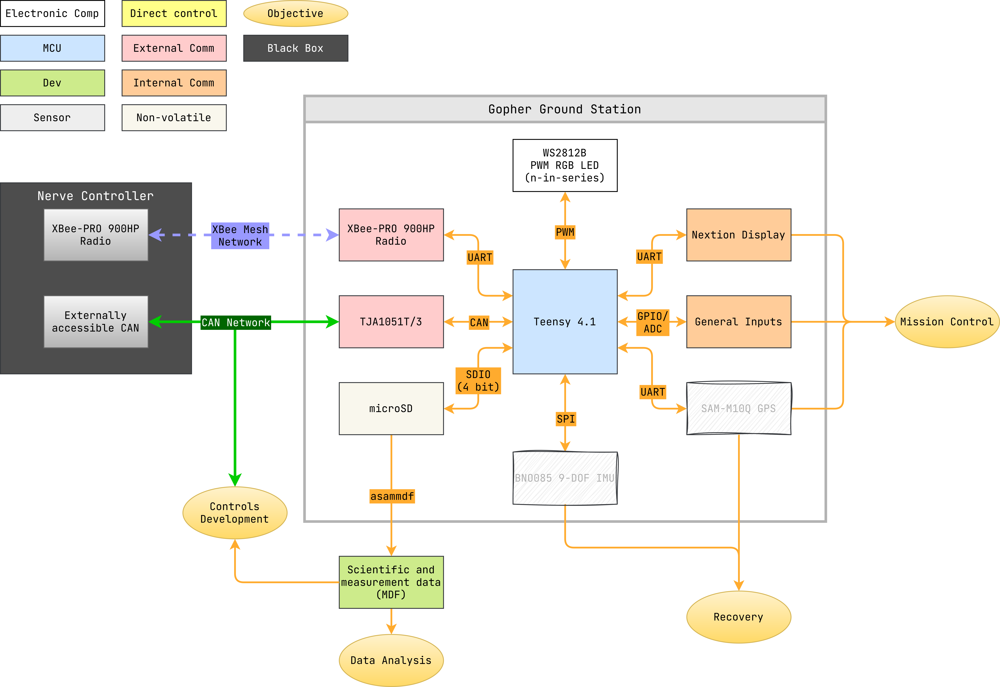

# gopher


Ground station for Nerve controller system.

---

<details markdown="1">
  <summary>Table of Contents</summary>

<!-- TOC -->
* [gopher](#gopher)
  * [1 Overview](#1-overview)
  * [2 Development](#2-development)
    * [2.1 GitHub Actions Workflows](#21-github-actions-workflows)
      * [2.3 black](#23-black)
      * [2.3 pytest](#23-pytest)
      * [2.3 pyinstaller](#23-pyinstaller)
<!-- TOC -->

</details>

---

## 1 Overview



> Drawio file here: [gopher.drawio](docs/gopher.drawio)

## 2 Development

### 2.1 GitHub Actions Workflows

#### 2.3 black

[black_formatter.yaml](.github/workflows/black_formatter.yaml)

#### 2.3 pytest

[pytest.yaml](.github/workflows/pytest.yaml)

#### 2.3 pyinstaller

PyInstaller macOS, Windows, Linux `main.spec` builds workflow is saved
in [docs/pyinstaller.yaml](docs/pyinstaller.yaml) for reference.

- Discontinued use due to high GitHub Actions storage consumption (could be
  optimized much better).

The badge markdown would be as follows:

```

```
